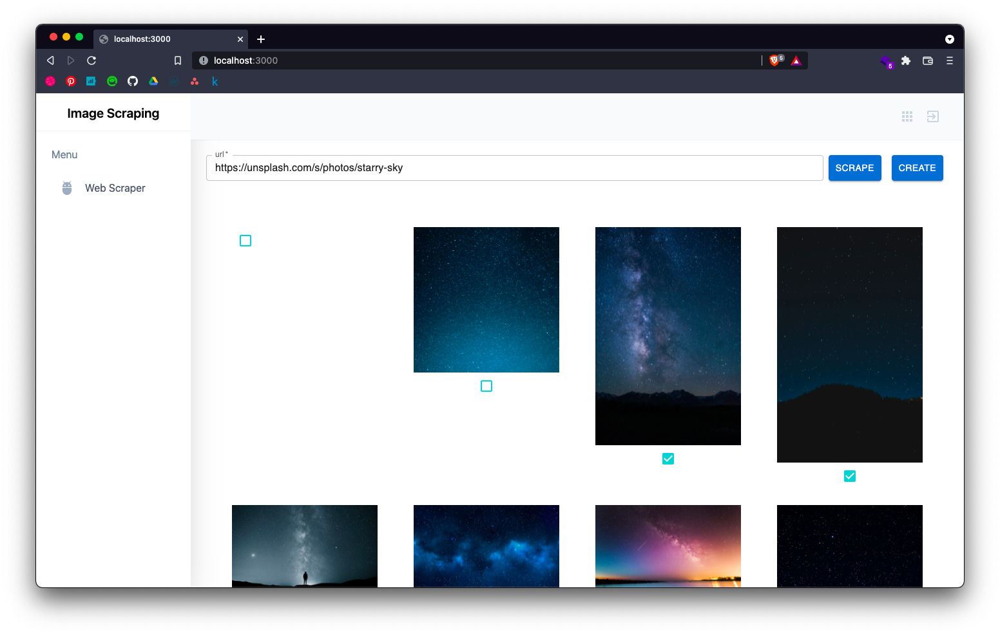

# Image-Scraping-Web
Web Application for Image-Scraping  

backend server is [Here](https://github.com/sasayabaku/Image-Scraping).




# Quick Start
1. Launch backend server 

```bash
$ docker compose up
```

2. Launch Web Application

```bash
$ yarn build && yarn start
```

3. Let's Scrape

Access http://localhost:9999